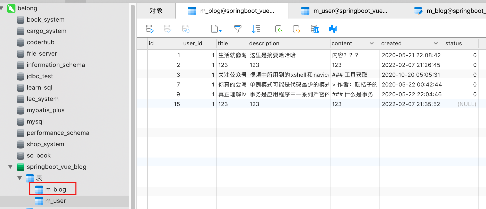
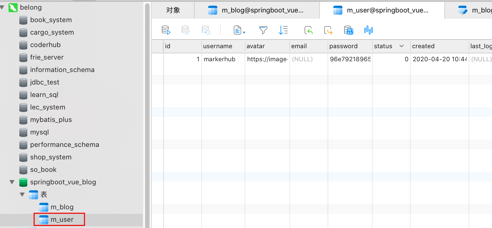
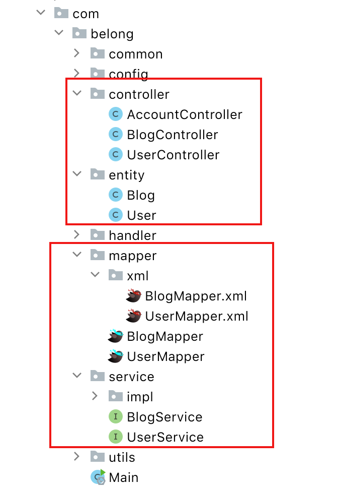
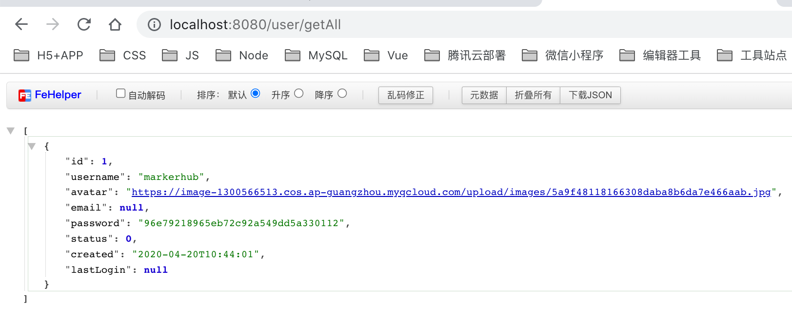
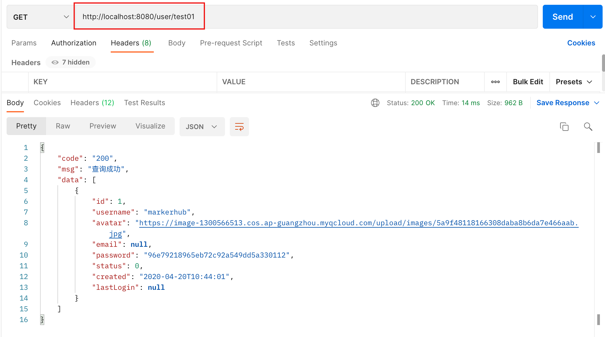
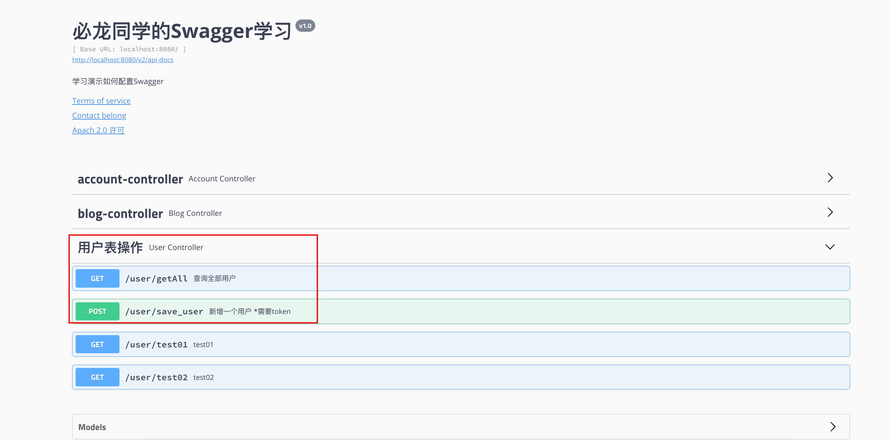
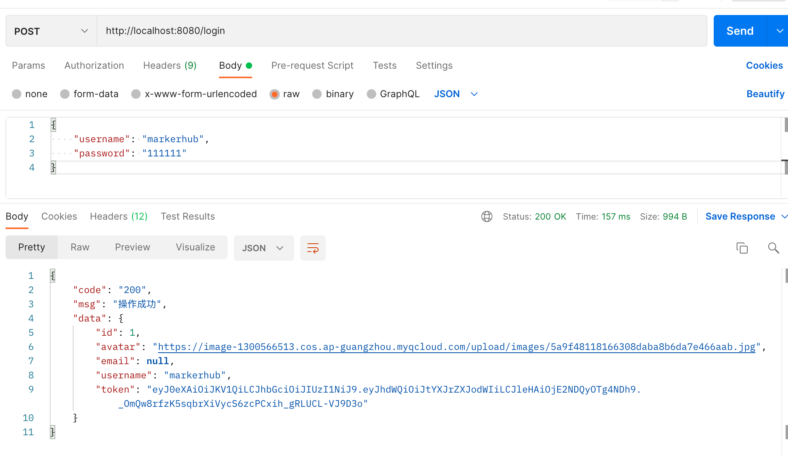
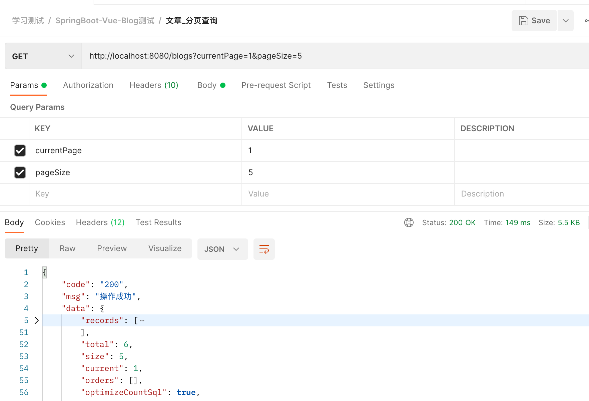

# SpringBoot_开发

## 一、环境搭建

### 1.1 软件版本

+ IntelliJ IDEA 2021.1
+ MySQL 8.0.19
+ redis
+ springboot2.4.4
+ maven 3.6.3


### 1.2 技术选型

+ SpringBoot
+ mybatis plus
+ shiro
+ lombok
+ redis
+ jwt
+ spring-boot-starter-validation


### 1.3 SQL导入

- 直接导入markerhub给我们提供的SQL文件即可

  





## 二、新建SpringBoot项目

### 2.1 依赖包

- 新建步骤比较简单，我们就不截图了，pom的jar包导入如下：

  - devtools：项目的热加载重启插件，参考：`SpringBoot`热更新

  ```xml
  <dependency>
      <groupId>org.projectlombok</groupId>
      <artifactId>lombok</artifactId>
  </dependency>
  
  <dependency>
      <groupId>org.springframework.boot</groupId>
      <artifactId>spring-boot-starter-jdbc</artifactId>
  </dependency>
  
  <dependency>
      <groupId>org.springframework.boot</groupId>
      <artifactId>spring-boot-starter-web</artifactId>
  </dependency>
  
  <dependency>
      <groupId>org.springframework.boot</groupId>
      <artifactId>spring-boot-devtools</artifactId>
      <scope>runtime</scope>
      <optional>true</optional>
  </dependency>
  
  <dependency>
      <groupId>org.springframework.boot</groupId>
      <artifactId>spring-boot-starter-test</artifactId>
      <scope>test</scope>
  </dependency>
  ```


### 2.2 yaml配置

- ***application.yaml***

  ```yaml
  spring:
      # 热部署
    devtools:
      restart:
        enabled: true  #设置开启热部署
        additional-paths: src/main/java #重启目录
        exclude: WEB-INF/**
      freemarker:
        cache: false    #页面不加载缓存，修改即时生效
      thymeleaf:
        encoding: utf-8
        # 禁用缓存
        cache: false
  ```


## 三、整合mybatis plus

### 3.1 导入jar包

- pom中导入mybatis plus的jar包，因为后面会涉及到代码生成，所以我们还需要导入页面模板引擎，这里我们用的是freemarker。

  ```xml
  <!--MP 代码生成器-->
  <dependency>
      <groupId>com.baomidou</groupId>
      <artifactId>mybatis-plus-generator</artifactId>
      <version>3.4.0</version>
  </dependency>
  
  <!--代码生成器所需的模板-->
  <dependency>
      <groupId>org.springframework.boot</groupId>
      <artifactId>spring-boot-starter-freemarker</artifactId>
  </dependency>
  
  <!--MP-->
  <dependency>
      <groupId>com.baomidou</groupId>
      <artifactId>mybatis-plus-boot-starter</artifactId>
      <version>3.5.1</version>
  </dependency>
  
  <dependency>
      <groupId>mysql</groupId>
      <artifactId>mysql-connector-java</artifactId>
  </dependency>
  ```


### 3.2 编写配置文件

- ***application.yaml***

  ```yaml
  spring:
    datasource:
      username: root
      password: 12345678
      url: jdbc:mysql://localhost:3306/springboot_vue_blog
  
  mybatis-plus:
    configuration:
      # 配置日志（默认控制台输出）
      log-impl: org.apache.ibatis.logging.stdout.StdOutImpl
  
  mybatis:
    # 扫描resources -> mapper目录下的所有xml文件
    mapper-locations: classpath:mapper/*.xml
  ```


### 3.3 开启mapper接口扫描，添加分页插件

- com.belong.config.MybatisPlusConfig

  ```java
  @MapperScan("com.belong.**.mapper")
  @Configuration  // 开启配置
  public class MybatisPlusConfig {
      // 注册分页插件 - 最新版
      @Bean
      public MybatisPlusInterceptor mybatisPlusInterceptor() {
          MybatisPlusInterceptor interceptor = new MybatisPlusInterceptor();
          interceptor.addInnerInterceptor(new PaginationInnerInterceptor(DbType.H2));
          return interceptor;
      }
  }
  ```


### 3.4 代码生成

- 如果没再用其他插件，那么现在就已经可以使用mybatis plus了，官方给我们提供了一个代码生成器，然后我写上自己的参数之后，就可以直接根据数据库表信息生成entity、service、mapper等接口和实现类。

- com.belong.utils.CodeGenerator

  ```java
  package com.belong.utils;
  
  import com.baomidou.mybatisplus.annotation.FieldFill;
  import com.baomidou.mybatisplus.generator.AutoGenerator;
  import com.baomidou.mybatisplus.generator.config.*;
  import com.baomidou.mybatisplus.generator.config.po.TableFill;
  import com.baomidou.mybatisplus.generator.config.rules.NamingStrategy;
  import com.baomidou.mybatisplus.generator.engine.FreemarkerTemplateEngine;
  
  import java.util.ArrayList;
  
  public class CodeGenerator {
      public static void main(String[] args) {
          // 构建一个代码生成器对象
          AutoGenerator mpg = new AutoGenerator();
  
          // 1. 全局配置
          GlobalConfig gc = new GlobalConfig();
          String projectPath = System.getProperty("user.dir");  // 获取当前IDEA的project目录
  
          //将代码生成到哪个目录下
          gc.setOutputDir(projectPath + "/src/main/java");
          gc.setAuthor("belong");  // 新增作者注释
          gc.setOpen(false);  // 执行成功后是否打开资源文件夹
          gc.setFileOverride(false);  // 是否覆盖原有的文件
          gc.setSwagger2(true); // 实体属性 Swagger2 注解
          gc.setServiceName("%sService");  // 去除Service的I前缀
          mpg.setGlobalConfig(gc);
  
          // 2. 数据源配置
          DataSourceConfig dataSource = new DataSourceConfig();
          dataSource.setUrl("jdbc:mysql://localhost:3306/springboot_vue_blog");
          dataSource.setDriverName("com.mysql.cj.jdbc.Driver");
          dataSource.setUsername("root");
          dataSource.setPassword("12345678");
          mpg.setDataSource(dataSource);
  
          // 3. 包配置
          PackageConfig pc = new PackageConfig();
          pc.setParent("com.belong");
          mpg.setPackageInfo(pc);
  
          // 4. 策略配置
          StrategyConfig strategy = new StrategyConfig();
          // 根据数据表名来生成代码，可以传入多个数据库名
          strategy.setInclude("m_blog", "m_user");
          // 数据库驼峰转下划线规则
          strategy.setNaming(NamingStrategy.underline_to_camel);
          // 实体类字段如上
          strategy.setColumnNaming(NamingStrategy.underline_to_camel);
          // 开启驼峰命名
          strategy.setRestControllerStyle(true);
          // 接口路径采用下划线风格：localhost:8080/hello_id_2
          strategy.setControllerMappingHyphenStyle(true);
          strategy.setEntityLombokModel(true);  // 是否使用lombok开启注解
          strategy.setTablePrefix("m_"); // 设置数据表前缀
  
          // 4.1 自动填充功能(可选，也可以在数据库层实现)
          TableFill create_time = new TableFill("created", FieldFill.INSERT);
          ArrayList<TableFill> tableFills = new ArrayList<>();
          tableFills.add(create_time);
          strategy.setTableFillList(tableFills);
  
          mpg.setStrategy(strategy);
          mpg.setTemplateEngine(new FreemarkerTemplateEngine());
          mpg.execute();  // 执行
      }
  }
  ```


- 运行CodeGenerator的main方法，生成结果如下：

  


### 3.5 测试

- 在UserController编写一个接口进行测试

  ```java
  @RestController
  @RequestMapping("/user")
  public class UserController {
      @Autowired
      UserServiceImpl userService;
  
      @GetMapping("/getAll")
      public List<User> getAllUser() {
          return userService.list();
      }
  }
  ```


- 访问：http://localhost:8080/user/getAll 获得结果如下，整合成功！




## 四、统一结果封装

### 4.1 Result封装类

- 这里我们用到了一个Result的类，这个用于我们的异步统一返回的结果封装。一般来说，结果里面有几个要素必要的
  - 是否成功，可用code表示（如200表示成功，400表示异常）
  - 结果消息
  - 结果数据

- 所以可得到封装如下：com.belong.common.Result

  ```java
  package com.belong.common;
  
  import lombok.AllArgsConstructor;
  import lombok.Data;
  import lombok.NoArgsConstructor;
  import com.belong.common.Result;
  
  @Data
  @AllArgsConstructor
  @NoArgsConstructor
  public class Result {
      private String code;
      private String msg;
      private Object data;
  
      // 成功的数据响应
      public static Result success(Object data) {
          return new Result("200", "操作成功", data);
      }
  
      public static Result success(String code, String msg,Object data) {
          return new Result(code, msg, data);
      }
  
      // 失败的数据响应
      public static Result fail(String msg) {
          return new Result("500", msg, null);
      }
  
      public static Result fail(String code, String msg,Object data) {
          return new Result(code, msg, data);
      }
  }
  ```


### 4.2 测试

- 在UserController中编写接口进行测试，**返回值为Result类**

  ```java
  @RestController
  @RequestMapping("/user")
  public class UserController {
      @Autowired
      UserServiceImpl userService;
  
      @GetMapping("/test01")
      public Result test01() {
          return Result.success("200", "查询成功", userService.list());
      }
  }
  ```

- postman测试，可查看到结果集封装成功！




## 五、拦截器 + JWT拦截资源

### 5.1 导入jar包

- pom.xml， 为了简化开发，我引入了hutool工具包

  ```xml
  <!-- hutool工具类-->
  <dependency>
      <groupId>cn.hutool</groupId>
      <artifactId>hutool-all</artifactId>
      <version>5.3.3</version>
  </dependency>
  
  <!-- 生成和校验token的工具类-->
   <dependency>
       <groupId>com.auth0</groupId>
       <artifactId>java-jwt</artifactId>
       <version>3.8.2</version>
  </dependency>
  ```


### 5.2 编写JwtUtils工具类

- com.belong.utils.JwtUtils

  ```java
  package com.belong.utils;
  
  import com.auth0.jwt.JWT;
  import com.auth0.jwt.algorithms.Algorithm;
  import com.auth0.jwt.exceptions.JWTVerificationException;
  import com.auth0.jwt.interfaces.JWTVerifier;
  
  import java.util.Date;
  
  /**
   * @description: Jwt工具类，生成JWT和认证
   */
  public class JwtUtils {
      // 密钥
      public static final String SECRET_KEY = "my_first_token";
  
      // token 过期时间 30分钟
      public static final int ExpiresIn = 1000 * 60 * 30;
  
      // 生成token
      public static String createToken(String username) {
          String token = "";
  
          // 传入用户信息和密钥来生成token
          token = JWT.create()
                  .withAudience(username) // 传入用户信息
                  .withExpiresAt(new Date(System.currentTimeMillis() + ExpiresIn))  // token过期时间
                  .sign(Algorithm.HMAC256(SECRET_KEY));  // 传入密钥生成token
  
          return token;
      }
  
      // 校验token
      public static Boolean verifyToken(String token) {
          try {
              // 根据密钥来校验token
              JWTVerifier jwtVerifier = JWT.require(Algorithm.HMAC256(SECRET_KEY)).build();
              jwtVerifier.verify(token);
              System.out.println("token校验成功");
              return true;
  
          } catch (JWTVerificationException e) {
              throw new RuntimeException("token校验失败");
          }
      }
  }
  ```


### 5.3 拦截器校验token

- 编写拦截器处理逻辑：com.belong.config.UserLoginInterceptor

  ```java
  package com.belong.config;
  
  import com.belong.utils.JwtUtils;
  import org.springframework.web.servlet.HandlerInterceptor;
  
  import javax.servlet.http.HttpServletRequest;
  import javax.servlet.http.HttpServletResponse;
  
  /**
   * 拦截器：验证用户是否登录
   */
  public class UserLoginInterceptor implements HandlerInterceptor {
      @Override
      public boolean preHandle(HttpServletRequest request, HttpServletResponse response, Object handler) throws Exception {
          // 设置响应数据格式，防止浏览器接收中文出现乱码
          response.setContentType("text/html;charset=utf-8");
  
          // 1. 从请求头中获取token
          String token = request.getHeader("Authorization");
          if (token == null) {
              throw new RuntimeException("你还未登录，请先去登录");
          }
  
          // 2. 校验token
          Boolean verifyToken = JwtUtils.verifyToken(token);
          if (!verifyToken) {
              return  false;
          }
  
          return true;
      }
  }
  ```

  

- 配置拦截器

  ```java
  package com.belong.config;
  
  import org.springframework.context.annotation.Configuration;
  import org.springframework.web.servlet.config.annotation.InterceptorRegistry;
  import org.springframework.web.servlet.config.annotation.WebMvcConfigurer;
  
  @Configuration
  public class WebMvcConfig implements WebMvcConfigurer {
      /**
       * 注册自定义拦截器
       */
      @Override
      public void addInterceptors(InterceptorRegistry registry) {
          registry.addInterceptor(new UserLoginInterceptor())
             		// 拦截器拦截指定路径
                  .addPathPatterns("/blog/edit", "/blog/delete", "/blog/add");  
      }
  }
  ```


## 六、全局异常处理

### 6.1 原理

- 有时候不可避免服务器报错的情况，如果不配置异常处理机制，就会默认返回tomcat或者nginx的5XX页面，对普通用户来说，不太友好，用户也不懂什么情况。这时候需要我们程序员设计返回一个友好简单的格式给前端。

- 处理办法如下：通过使用`@RestControllerAdvice`注解来进行统一异常处理，`@ExceptionHandler(value = RuntimeException.class)`来指定捕获的Exception各个类型异常 ，**这个异常的处理，是全局的**，所有类似的异常，都会跑到这个地方处理。

  

- 定义全局异常处理，`@RestControllerAdvice`表示定义全局控制器异常处理，`@ExceptionHandler`表示针对性异常处理，可对每种异常针对性处理。


### 6.2 捕获全局异常

- com.belong.common.exception;

  ```java
  @Slf4j
  @RestControllerAdvice
  public class GlobalExceptionHandler {
      // 断点异常
      @ResponseStatus(HttpStatus.BAD_REQUEST)
      @ExceptionHandler(value = IllegalArgumentException.class)
      public Result handler(IllegalArgumentException e) throws IOException {
          log.error("Assert异常:-------------->",e);
          return Result.fail(e.getMessage());
      }
  
      // 实体类校验异常
      @ResponseStatus(HttpStatus.BAD_REQUEST)
      @ExceptionHandler(value = MethodArgumentNotValidException.class)
      public Result handler(MethodArgumentNotValidException e) throws IOException {
          log.error("实体类校验异常:-------------->",e);
          BindingResult bindingResult = e.getBindingResult();
          ObjectError objectError = bindingResult.getAllErrors().stream().findFirst().get();
          return Result.fail("401", objectError.getDefaultMessage(), null);
      }
  
      // 处理运行时异常
      @ResponseStatus(HttpStatus.BAD_REQUEST)
      @ExceptionHandler(value = RuntimeException.class)
      public Result handler(RuntimeException e) throws IOException {
          log.error("运行时异常:-------------->",e);
          return Result.fail(e.getMessage());
      }
  }
  ```


## 七、实体类校验


当我们表单数据提交的时候，前端的校验我们可以使用一些类似于jQuery Validate等js插件实现，而后端我们可以使用Hibernate validatior来做校验。


>也就是在我们之前学习过的**JSR303校验可以对实体类的请求参数进行校验**

### 7.1 导入jar包

```xml
<dependency>
    <groupId>org.springframework.boot</groupId>
    <artifactId>spring-boot-starter-validation</artifactId>
</dependency>
```


### 7.2 使用校验

- 第一步：在实体的属性上添加对应的校验规则，比如：

  - 注：需要给实体类添加`@Validated`注解

  ```java
  @Data
  @EqualsAndHashCode(callSuper = false)
  @TableName("m_user")
  @ApiModel(value="User对象", description="")
  @Validated // 数据校验
  public class User implements Serializable {
  
      private static final long serialVersionUID = 1L;
  
      @TableId(value = "id", type = IdType.AUTO)
      private Long id;
  
      @NotBlank(message = "昵称不能为空")
      private String username;
  
      private String avatar;
  
      @NotBlank(message = "昵称不能为空")
      @Email(message = "邮箱格式不正确")
      private String email;
  
      @NotBlank(message = "密码不能为空")
      private String password;
  
      private Integer status;
  
      private LocalDateTime created;
  
      private LocalDateTime lastLogin;
  }
  ```


- 第二步：这里我们使用`@Validated`注解方式校验JSON请求体参数，如果实体不符合要求，系统会抛出异常，那么我们的异常处理中就捕获到`MethodArgumentNotValidException`。

  ```java
  @RestController
  @RequestMapping("/user")
  public class UserController {
      @Autowired
      UserServiceImpl userService;
  
      @PostMapping("/save_user")
      public Result test03(@Validated @RequestBody User user) {
          return Result.success(user);
      }
  }
  ```


## 八、解决跨域

- 由于我们使用了拦截器来配置token，因此使用`addCorsMappings`方式就会失效，所以我们**使用filter来解决跨域**

- CorsFilter.java

  ```java
  package com.belong.config;
  
  import javax.servlet.*;
  import javax.servlet.annotation.WebFilter;
  import javax.servlet.http.HttpServletRequest;
  import javax.servlet.http.HttpServletResponse;
  import java.io.IOException;
  
  @WebFilter("/*")
  public class CorsFilter implements Filter {
      @Override
      public void doFilter(ServletRequest servletRequest, ServletResponse servletResponse, FilterChain filterChain) throws IOException, ServletException {
  
          HttpServletRequest req = (HttpServletRequest) servletRequest;
          HttpServletResponse res = (HttpServletResponse) servletResponse;
  
          res.setHeader("Access-Control-Allow-Origin", "*");
          res.setHeader("Access-Control-Allow-Credentials", "true");
          res.setHeader("Access-Control-Allow-Methods", "*");
          res.setHeader("Access-Control-Max-Age", "3600");
          res.setHeader("Access-Control-Allow-Headers", "Authorization,Origin,X-Requested-With,Content-Type,Accept,"
                  + "content-Type,origin,x-requested-with,content-type,accept,authorization,token,id,X-Custom-Header,X-Cookie,Connection,User-Agent,Cookie,*");
          res.setHeader("Access-Control-Request-Headers", "Authorization,Origin, X-Requested-With,content-Type,Accept");
          res.setHeader("Access-Control-Expose-Headers", "*");
          filterChain.doFilter(servletRequest, servletResponse);
      }
  }
  ```

  

- 别忘了给入口类添加`@ServletComponentScan`注解

  ```java
  @SpringBootApplication
  @ServletComponentScan
  public class Main {
      public static void main(String[] args) {
          SpringApplication.run(Main.class, args);
      }
  }
  ```


## 九、集成Swagger2

1. 导入swagger2依赖

   - 注：要使用2.5.x版本的springboot才能兼容swagger2

   ```xml
   <!-- https://mvnrepository.com/artifact/io.springfox/springfox-swagger2 -->
   <dependency>
       <groupId>io.springfox</groupId>
       <artifactId>springfox-swagger2</artifactId>
       <version>2.9.2</version>
   </dependency>
   <!-- https://mvnrepository.com/artifact/io.springfox/springfox-swagger-ui -->
   <dependency>
       <groupId>io.springfox</groupId>
       <artifactId>springfox-swagger-ui</artifactId>
       <version>2.9.2</version>
   </dependency>
   ```

2. 添加swagger配置文件：config.SwaggerConfig

   ```java
   package com.belong.config;
   
   import org.springframework.context.annotation.Bean;
   import org.springframework.context.annotation.Configuration;
   import springfox.documentation.service.ApiInfo;
   import springfox.documentation.service.Contact;
   import springfox.documentation.spi.DocumentationType;
   import springfox.documentation.spring.web.plugins.Docket;
   import springfox.documentation.swagger2.annotations.EnableSwagger2;
   
   import java.util.ArrayList;
   
   // SwaggerConfig.java
   @Configuration //配置类
   @EnableSwagger2// 开启Swagger2的自动配置
   public class SwaggerConfig {
       @Bean
       public Docket docket() {
           return new Docket(DocumentationType.SWAGGER_2)
               .apiInfo(apiInfo())
               .select()
               .apis(RequestHandlerSelectors.basePackage("com.belong.controller"))
               .build();
       }
   
       //配置文档信息
       private ApiInfo apiInfo() {
           // 作者信息
           Contact contact = new Contact("belong", "", "33158742@qq.com");
           return new ApiInfo(
               "必龙同学的Swagger学习", // 标题
               "学习演示如何配置Swagger", // 描述
               "v1.0", // 版本
               "http://www.timecrush.cn:8018", // 组织链接
               contact, // 作者信息
               "Apach 2.0 许可", // 许可
               "许可链接", // 许可连接
               new ArrayList<>()// 扩展
           );
       }
   }
   ```

   

3. 使用`@ApiOperation`和`@Api`对接口进行说明补充

   ```java
   @RestController
   @RequestMapping("/user")
   @Api(tags = "用户表操作")
   public class UserController {
       @Autowired
       UserServiceImpl userService;
   
       @ApiOperation("查询全部用户")
       @GetMapping("/getAll")
       public List<User> getAllUser() {
           return userService.list();
       }
       
       @ApiOperation("新增一个用户 *需要token")
       @PostMapping("/save_user")
       public Result test03(@Validated @RequestBody User user ) {
           return Result.success(user);
       }
   }
   ```

4. 访问http://localhost:8080/swagger-ui.html，查看swagger文档

   


## 十、业务层开发

### 10.1 登录接口开发

- 登录的逻辑其实很简单，只需要接受账号密码，然后把用户的username生成jwt，返回给前端，具体代码如下：

 -  LoginDto.java

    ```java
    package com.belong.common.dto;
    
    import lombok.Data;
    import org.springframework.validation.annotation.Validated;
    
    import javax.validation.constraints.Email;
    import javax.validation.constraints.NotBlank;
    
    @Data
    @Validated
    public class LoginDto {
        @NotBlank(message = "昵称不能为空")
        private String username;
    
        @NotBlank(message = "密码不能为空")
        private String password;
    }
    ```

    

- AccountController.java

  ```java
  @RestController
  public class AccountController {
      @Autowired
      UserServiceImpl userService;
  
      @PostMapping("/login")
      public Result login(@Validated @RequestBody LoginDto loginDto) {
          // 1. 判断用户名密码是否为空，JSR303校验已经帮我们做好了
          // 2. 查询数据库是否有该用户
          QueryWrapper<User> wrapper = new QueryWrapper<>();
          wrapper.eq("username", loginDto.getUsername());
          User user = userService.getOne(wrapper);
          Assert.notNull(user, "用户不存在");
  
          // 3. 校验密码是否与数据库匹配匹对
          String password = SecureUtil.md5(loginDto.getPassword());
          System.out.println(password);
          if (!user.getPassword().equals(password)) {
              return Result.fail("密码错误");
          }
  
          // 3. 生成token，与用户信息一起返回给前端
          String token = JwtUtils.createToken(user.getUsername());
  
          return Result.success(MapUtil.builder()
                  .put("id", user.getId())
                  .put("username", user.getUsername())
                  .put("avatar", user.getAvatar())
                  .put("email", user.getEmail())
                  .put("token", token)
                  .map()
          );
      }
  }
  ```


- postman测试

  


### 10.2 博客接口开发

- 我们的骨架已经完成，接下来，我们就可以添加我们的业务接口了，下面我以一个简单的博客列表、博客详情页为例子开发：

- com.belong.controller.BlogController

  ```java
  @RestController
  public class BlogController {
      @Autowired
      BlogServiceImpl blogService;
  
      // 分页查询
      @GetMapping("/blogs")
      public Result list(@RequestParam Integer currentPage, @RequestParam Integer pageSize) {
          Page<Blog> page = new Page<>(currentPage, pageSize);
          Page<Blog> page1 = blogService.page(page);
          return Result.success(page1);
      }
  
      // 根据id查询
      @GetMapping("/blog/{id}")
      public Result detial(@PathVariable Integer id) {
          Blog blog = blogService.getById(id);
          Assert.notNull(blog, "该文章已被删除");
          return Result.success(blog);
      }
  
      // 编辑文章
      @PutMapping("/blog/edit")
      public Result edit(@Validated @RequestBody Blog blog) {
          // 只能够编辑当前登录的用户id的文章
          UpdateWrapper<Blog> wrapper = new UpdateWrapper<>();
          wrapper.eq("id", blog.getId())
                  .eq("user_id", blog.getUserId());
          boolean b = blogService.update(blog, wrapper);
          return Result.success("200", "编辑成功", null);
      }
  
      // 删除文章
      @DeleteMapping("/blog/delete/{id}")
      public Result delete(@PathVariable Integer id) {
          blogService.removeById(id);
          return Result.success("200", "删除成功", null);
      }
  
  
      // 新增文章
      @PostMapping("/blog/add")
      public Result add(@Validated @RequestBody Blog blog) {
          blogService.save(blog);
          return Result.success("200", "新增成功", null);
      }
  }
  ```

  

- 接口比较简单，我们就不多说了，基本增删改查而已。注意的是edit方法是需要登录才能操作的受限资源。**如果需要token才能访问的接口，那么在拦截器中配置相应的路径即可**


- 接口测试

  


>到此为止，我们可以算是熟悉了大部分SpringBoot的项目结构流程了，接下来就是继续做项目巩固知识点，笔者打算做一期仿智慧城市接口的项目，不过这得安排到4月后了，准备冲专升本了🥳


## 参考

>MarkerHub博客：https://juejin.cn/post/6844903823966732302#heading-5
>
>SpringBoot集成Jwt：https://www.jianshu.com/p/e88d3f8151db
>
>SpringBoot解决跨域：https://www.jianshu.com/p/9203e9b14465
>
>SpringBoot整合Swagger：https://www.cnblogs.com/likeyou99315/p/15606120.html
>
>springboot2.4 数据校验：https://zhuanlan.zhihu.com/p/345192773


